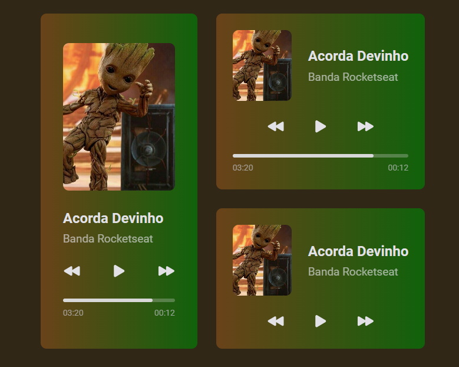

<h1 align="center"> Music Player App </h1>

  

<h3 align="left"> Overview </h3>

 Welcome to the Groot Music Player, a simple and intuitive application for enjoying your favorite music. This application has been developed using HTML and CSS, providing a delightful user experience on both mobile and desktop devices. 

<h4 align="left"> Functionality </h4>
<strong> ▶️ Control of reproduction: </strong> Play, Pause, Next, Back and track time.

<h4 align="left"> Responsible </h4>
📱💻 Responsive for mobile and desktop devices.

<h4 align="left"> Technologies Used </h4>
⚡HTML  
🎨CSS

<h4 align="left"> License </h4>

This project is licensed under the MIT License - see the LICENSE file for details.

🎶🌳Enjoy the Groot Music Player! 🎶🌳